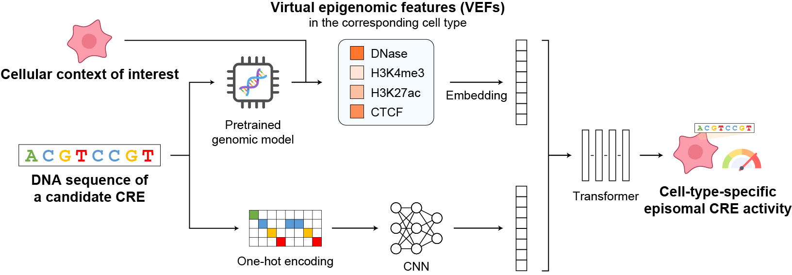

# EpiCast: leveraging virtual epigenomic features to predict episomal regulatory activity across cell types
The code for official implementation of "EpiCast: leveraging virtual epigenomic features to predict episomal regulatory activity across cell types".

## Introduction

## Installation

git clone https://github.com/maplecai/MPRA_predict.git
conda create -n mpra python=3.11
conda activate mpra
pip install -r requirements.txt

## Data preparation

## Predict CRE activity

## Citation
Under RECOMB 2026 review.

## License
MIT License.

## Contact
maplecai142857@gmail.com
